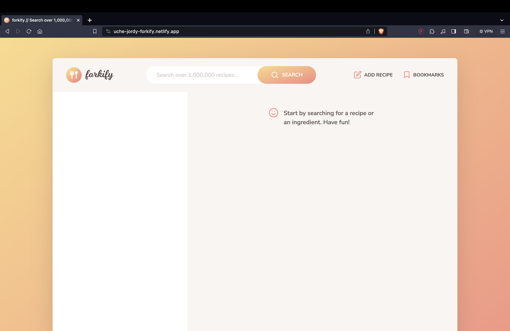
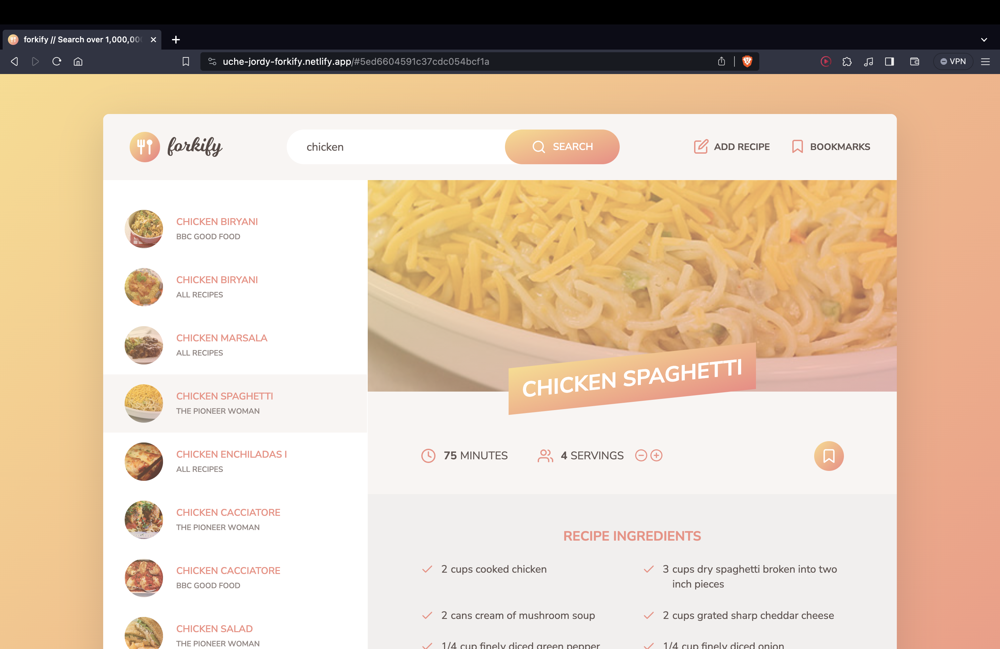
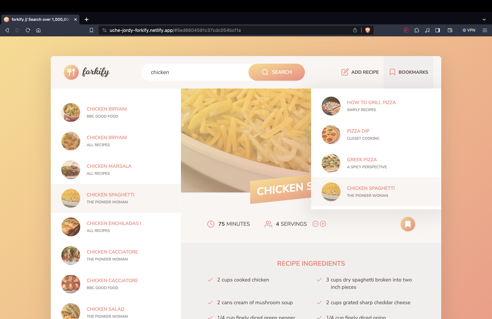
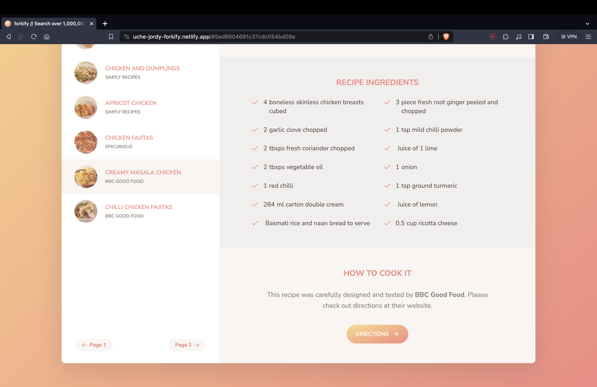

# [Forkify App: Cook Like a Chef 🍉](https://uche-jordy-forkify.netlify.app/)

Explore a world of culinary delights with Forkify, a dynamic web application designed for food enthusiasts and chefs alike. Experience the seamless integration of modern web technologies and design aesthetics at [Forkify](https://uche-jordy-forkify.netlify.app/).

## Features 🍓

- **Dynamic Recipe Search**: Discover a plethora of recipes with a robust, multi-page search functionality.
- **Recipe Details**: Each selection provides ingredients, portions, preparation time, and serving adjustments.
- **API Integration**: Leverage asynchronous JavaScript to fetch and post recipes to an external API.
- **Visual Appeal**: Immerse in a user-friendly interface crafted with HTML, CSS Grids, Flexbox, and JavaScript.
- **Bookmarking System**: Utilize the Web Storage API for bookmarking favorite recipes, with persistence across page reloads.
- **Responsive Loading**: Experience smooth interactions with dynamic loading images during data fetches.

## Installation and Setup

Ensure you have npm installed. Initialize a new project with:

\```bash
npm init
\```

### Dependencies

The Forkify app leverages several packages for optimal functionality:

- **Parcel** for application bundling.
- **SASS** for advanced styling capabilities.
- **Fractional & Fracty** for precise ingredient measurements.
- **Core-JS** and **Regenerator-Runtime** for comprehensive JavaScript feature support.

To install these dependencies, run:

\```bash
npm install @parcel/transformer-sass core-js fractional fracty regenerator-runtime sass
\```

### Scripts

Use the following scripts for development and production (inside package.json):

\```json
"scripts": {
"start": "parcel index.html",
"build": "parcel build index.html --dist-dir ./dist"
}
\```

##### Inside package.json

- Parcel v2

  > "build": "parcel build index.html --dist-dir ./dist"
  > This means: distribution directory inside a folder called 'dist'

- Parcel v1
  > "build": "parcel build index.html --out-dir ./dist"

## Contributing

Interested in contributing? Fork the repository here: [Forkify GitHub](https://github.com/UniLife-Projects/forkify-deployed.git).

## About the Developer

Developed by Jordy Uche, a passionate software engineer focused on creating engaging and innovative web applications.

## Sneak Peek






## License

This project is licensed under the ISC License.
